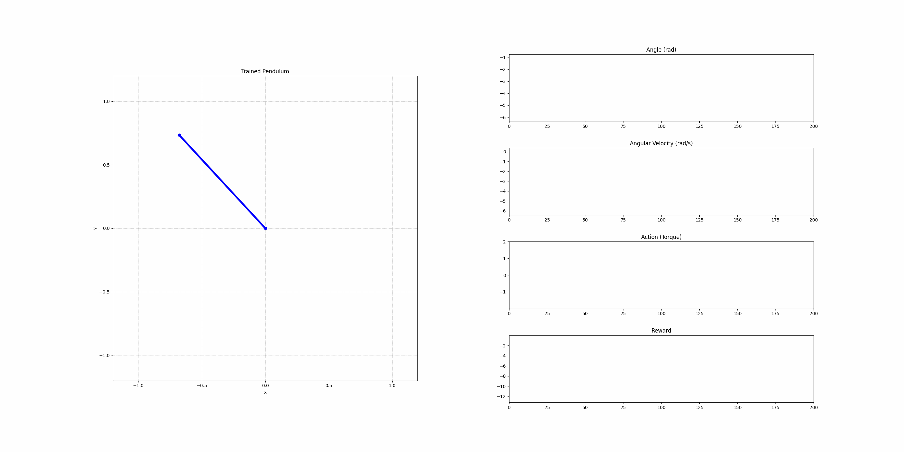

# Reinforcement Learning with Evolutionary Strategies for Inverted Pendulum Domain

<p align="center">
  
</p>

This project showcases a custom implementation of the Evolution Strategies (ES) algorithm applied to a continuous control problem inspired by the classic **Inverted Pendulum Swing-Up** task.

---

## Overview

- Custom JIT-compiled pendulum environment
- Lightweight neural network policy
- Evolution strategy for black-box optimization
- Notebook-driven experiments with plots, rollouts, and animations
- Grid search over hyperparameters to optimize training performance

---

## Notebooks

| Notebook | Description |
|----------|-------------|
| **01_environment_walkthrough.ipynb** | Builds and explores the custom pendulum environment. Visualizes behavior under random and scripted controllers. |
| **02_es_walkthrough.ipynb** | Step-by-step breakdown of how evolution strategy works using small population and manual perturbations. |
| **03_es_training_experiments.ipynb** | Runs a grid search across σ, α, population size, and network size. Produces performance plots and logs. |
| **04_final_evaluation.ipynb** | Loads the best config, retrains, and animates the resulting pendulum behavior with a saved `.gif`. |


## Getting Started

### 1. Clone the repo

```bash
git clone https://github.com/your-username/inverted-pendulum-es.git
cd inverted-pendulum-es
```

### 2. Install dependencies

```bash
pip install -r requirements.txt
```

### 3. Install as a package

```bash
pip install -e .
```

### 4. Run a notebook or training script

Explore the notebooks in [notebooks/](notebooks/)

Or run main.py

```bash
python main.py
```

--- 

## Evolution Strategy Overview

This project uses a custom implementation of **Evolution Strategy (ES)** — a simple yet powerful **gradient-free optimization algorithm** — to train a neural network policy for balancing the inverted pendulum.

Unlike traditional reinforcement learning algorithms, ES does not rely on backpropagation or gradients from the environment. Instead, it treats the policy as a black box and optimizes it through repeated sampling and evaluation.

### How It Works:

1. **Initialize** a parameterized policy (a small neural network)
2. **Evaluate** the policy over several episodes in a custom pendulum environment
3. **Generate perturbations** to the policy’s parameters using Gaussian noise
4. **Evaluate perturbed policies** and compare their performance to the baseline
5. **Estimate a search gradient** from the difference in performance
6. **Update the policy** in the direction of the estimated gradient

This is repeated over many iterations, gradually improving the policy based on its average performance.

### Inputs and Outputs

- The policy network receives a state vector:  
  `[ sin(θ), cos(θ), angular velocity ]`
- It outputs a single continuous **torque value** to control the pendulum.


## Reward Function Explained

The reward function used in this environment is designed to encourage the pendulum to stay upright, minimize wobbling, and avoid excessive force:

```python
reward = - (omega_normalized**2 + 0.1 * dot_omega**2 + self.torque_penalty * action**2)
```
Here's what each part means:
| Component                      | Description                                             |
|-------------------------------|---------------------------------------------------------|
| `omega_normalized**2`         | Penalizes the angle error from upright (θ = 0)          |
| `0.1 * dot_omega**2`          | Penalizes large angular velocity (reduces wobbling)     |
| `self.torque_penalty * action**2`           | Penalizes strong torque (encourages smooth control)     |


The maximum reward is 0 when the pendulum is perfectly balanced upright, not moving, and no torque is applied. The more it deviates from this, the more negative the reward becomes.